# MALAN UI Library with TailwindCSS

[](https://github.com/malan-lyi/malan-ui/blob/main/LICENSE)


---

This is a [Next.js](https://nextjs.org/) project bootstrapped with [`create-next-app`](https://github.com/vercel/next.js/tree/canary/packages/create-next-app).

## Getting Started

First, run the development server:

```bash
npm run dev
# or
yarn dev
# or
pnpm dev
# or
bun dev
```

Open [http://localhost:3000](http://localhost:3000) with your browser to see the result.

You can start editing the page by modifying `app/page.tsx`. The page auto-updates as you edit the file.

This project uses [`next/font`](https://nextjs.org/docs/basic-features/font-optimization) to automatically optimize and load Inter, a custom Google Font.

### Learn More

To learn more about Next.js, take a look at the following resources:

- [Next.js Documentation](https://nextjs.org/docs) - learn about Next.js features and API.
- [Learn Next.js](https://nextjs.org/learn) - an interactive Next.js tutorial.

You can check out [the Next.js GitHub repository](https://github.com/vercel/next.js/) - your feedback and contributions are welcome!

### Deploy on Vercel

The easiest way to deploy your Next.js app is to use the [Vercel Platform](https://vercel.com/new?utm_medium=default-template&filter=next.js&utm_source=create-next-app&utm_campaign=create-next-app-readme) from the creators of Next.js.

Check out our [Next.js deployment documentation](https://nextjs.org/docs/deployment) for more details.

---

## Components

- [Accordion](http://localhost:3000/en/component/accordion)
  <br/>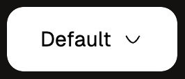
  <br/>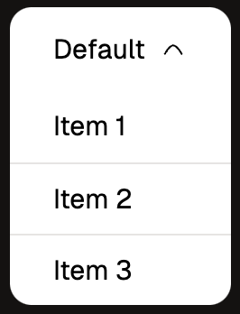
- [Badge](http://localhost:3000/en/component/badge)
  <br/>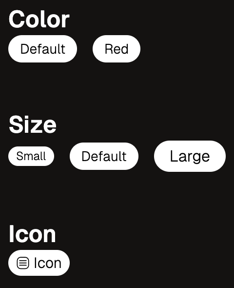
- [Button](http://localhost:3000/en/component/button)
  <br/>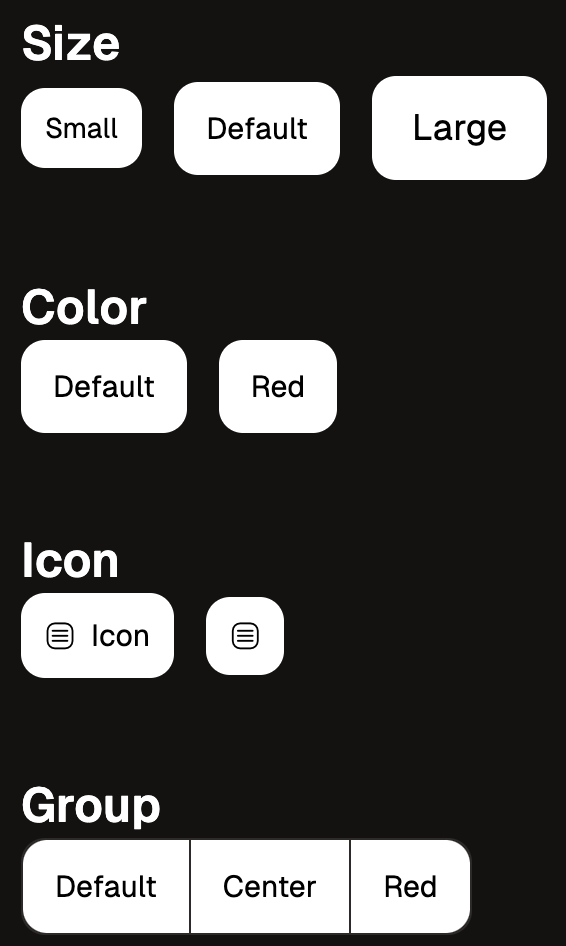
- [Card](http://localhost:3000/en/component/card)
  <br/>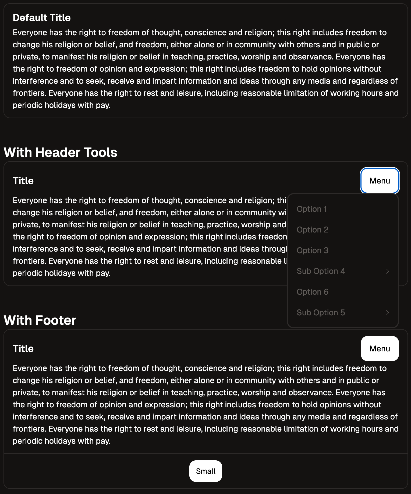
- [Checkbox](http://localhost:3000/en/component/checkbox)
  <br/>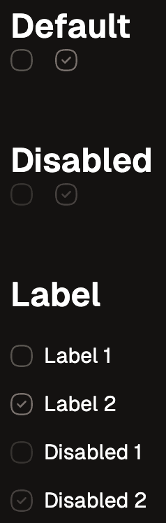
- [Collapse](http://localhost:3000/en/component/collapse)
  <br/>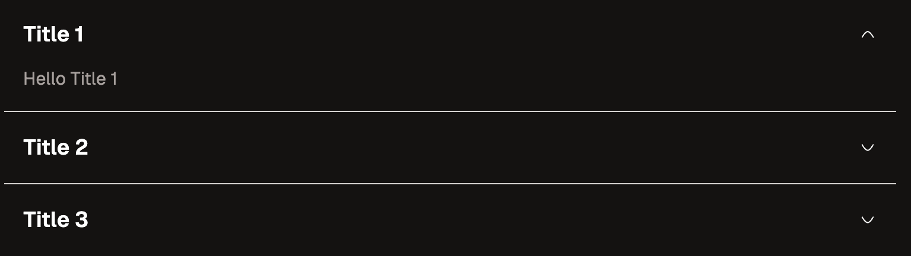
- [Date Picker](http://localhost:3000/en/component/datepicker)
    - with [`react-flatpickr`](https://www.npmjs.com/package/react-flatpickr)
- [Input](http://localhost:3000/en/component/input)
  <br/>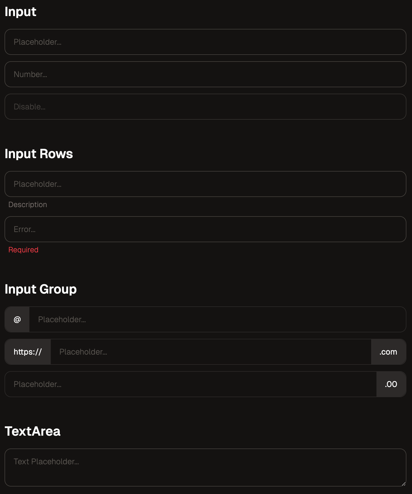
- [Loading](http://localhost:3000/en/component/loading)
  <br/>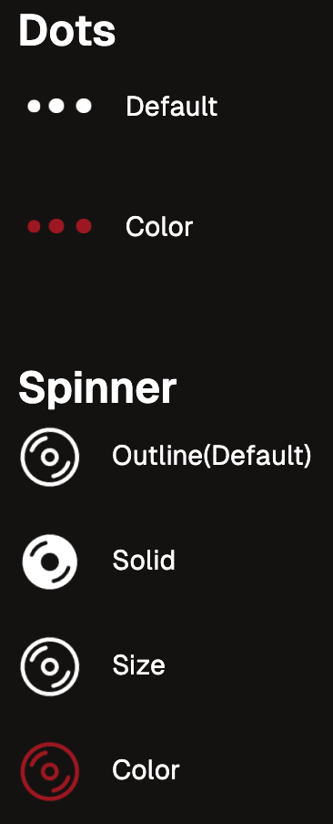
- [Menu](http://localhost:3000/en/component/menu)
  <br/>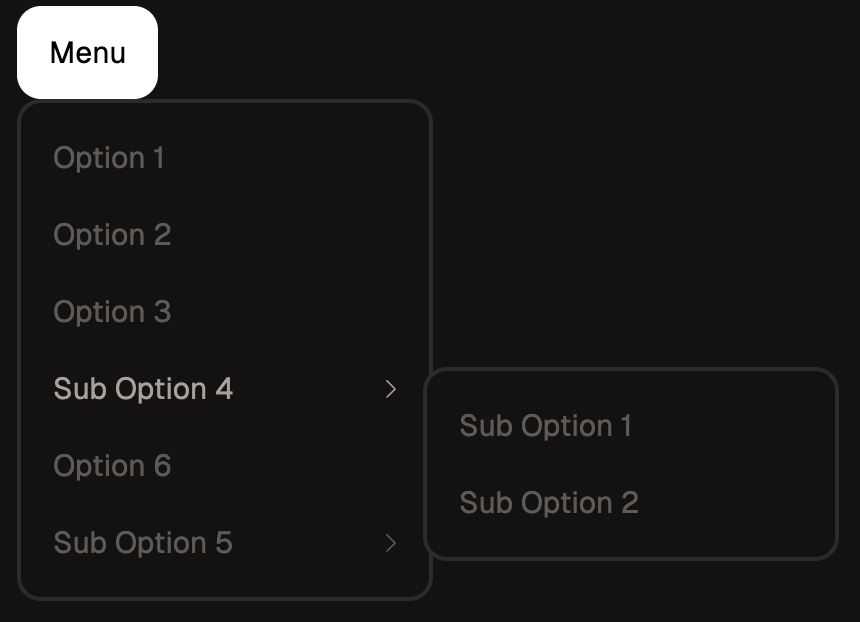
- [Modal](http://localhost:3000/en/component/modal)
  <br/>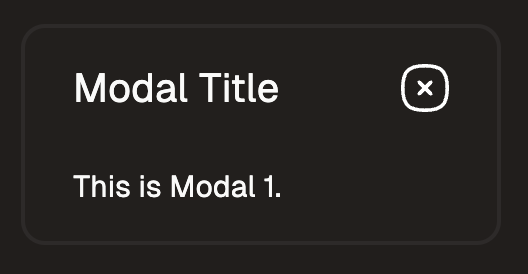
  <br/>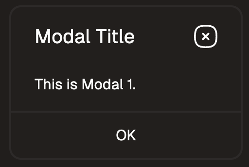
  <br/>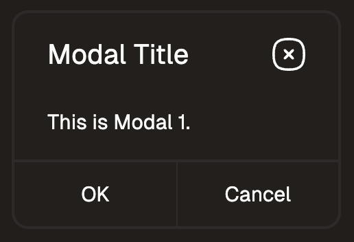
- [Progress](http://localhost:3000/en/component/progress)
  <br/>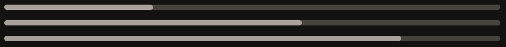
- [Radio](http://localhost:3000/en/component/radio)
  <br/>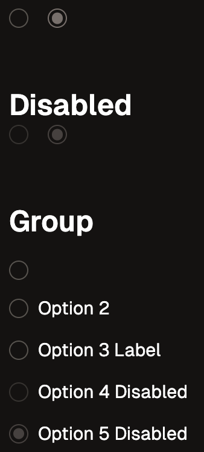
- [Switch](http://localhost:3000/en/component/switch)
  <br/>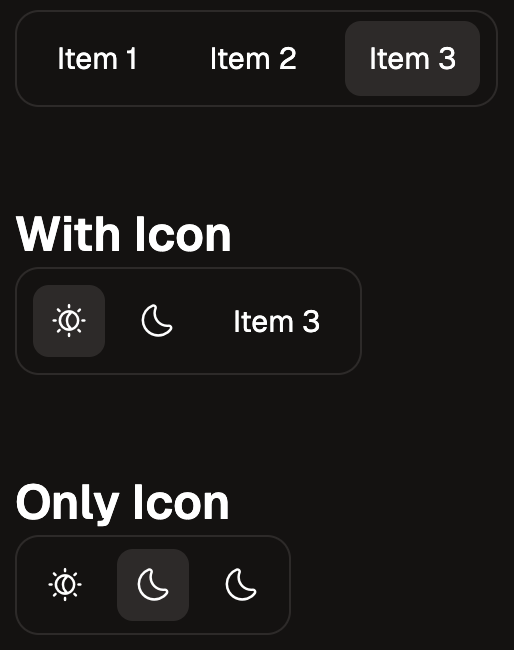
- [Table](http://localhost:3000/en/component/table)
  <br/>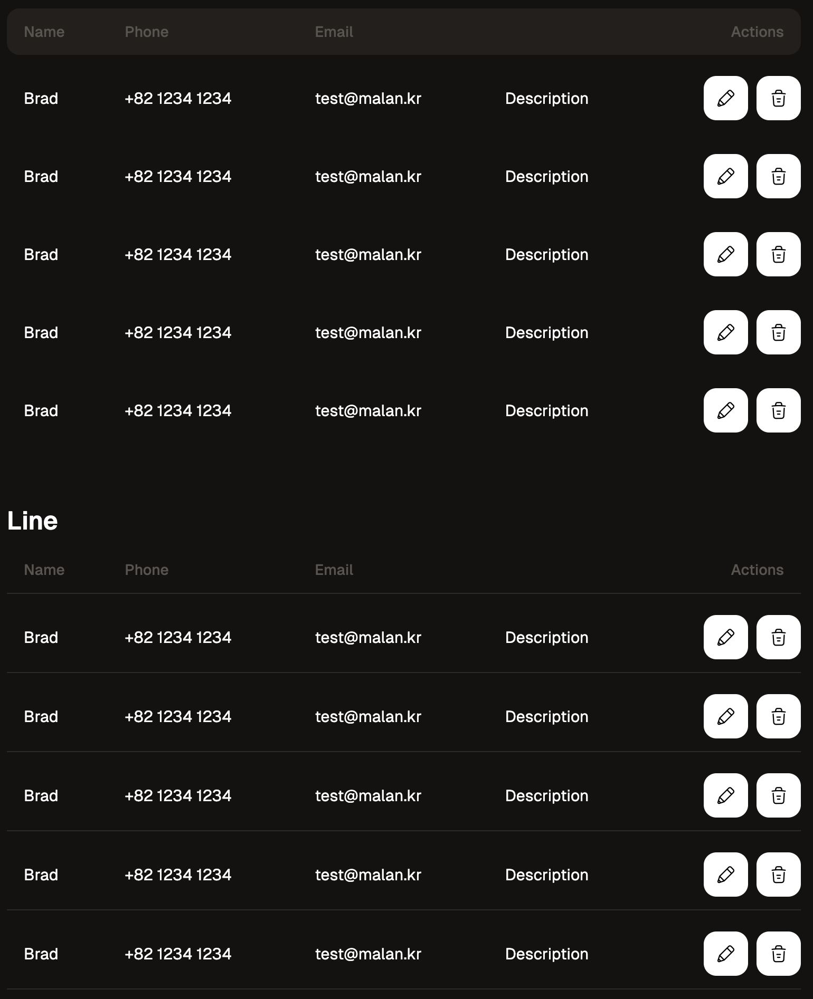
- [Tabs](http://localhost:3000/en/component/tabs)
  <br/>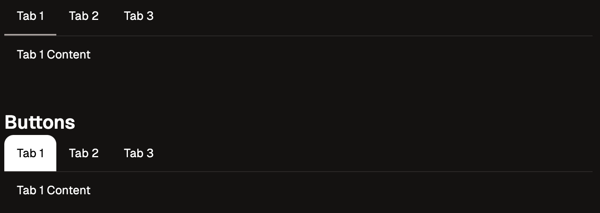
- [Tag](http://localhost:3000/en/component/tag)
    - with [`Tagify`](https://yaireo.github.io/tagify/)
  <br/>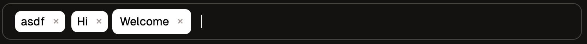
- [Toggle](http://localhost:3000/en/component/toggle)
    - with [`@popperjs/core`](https://www.npmjs.com/package/@popperjs/core), [`react-popper`](https://www.npmjs.com/package/react-popper)
  <br/>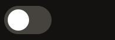

---

## License

This project is licensed under the terms of the
[MIT license](/LICENSE).

---

## Coming Soon

- breadcrumb
- calendar [Fullcalendar](https://fullcalendar.io/docs)
- chart
- drawer
- editor
- input [Floating](https://preview.keenthemes.com/html/metronic/docs/base/forms/floating-labels)
- pagination
- select [Select2](https://select2.org/)
- skeleton
- table [Datatable](https://datatables.net/)
- toast [Toaster](https://github.com/petekeller2/toastr)
- tooltip